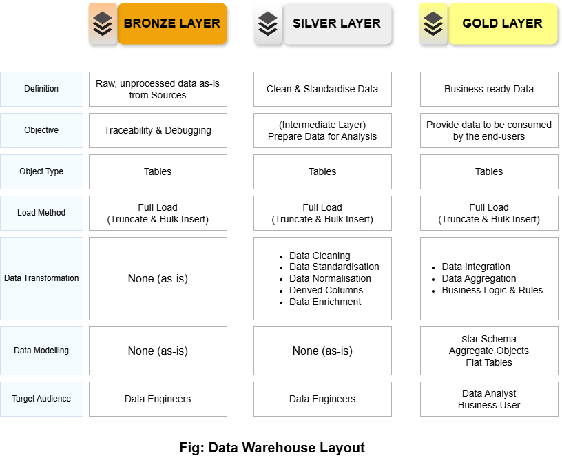
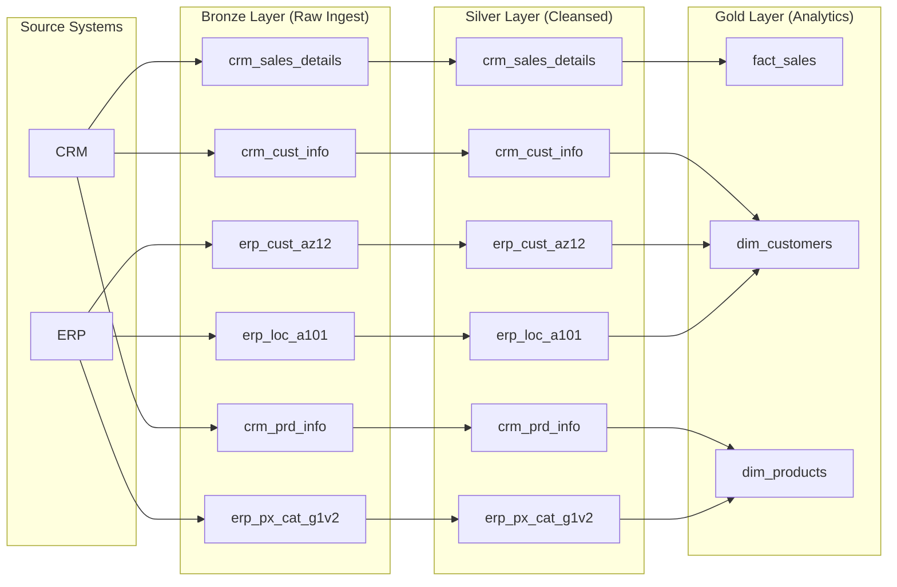

# Data Warehouse Dataflow and Architecture
This is a three layer data warehouse built following the medalion architecture and with data extracted from ERP and CRM . Again,  is developed centering the dimension around a fact table.

### Modeling Principles

- Bronze Layer

    - Immutable, replayable raw data

    - Schema changes tolerated

    - No joins or aggregations

- Silver Layer

    - One row = one business entity/event

    - Cleaned, deduplicated, standardized

    - Still traceable to source

- Gold Layer

    - Star schema optimized for analytics

    - Facts reference conformed dimensions

    - Business logic is applied once and reused everywhere
